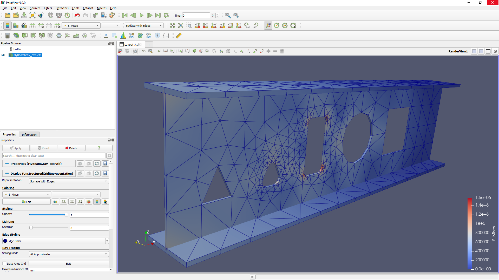
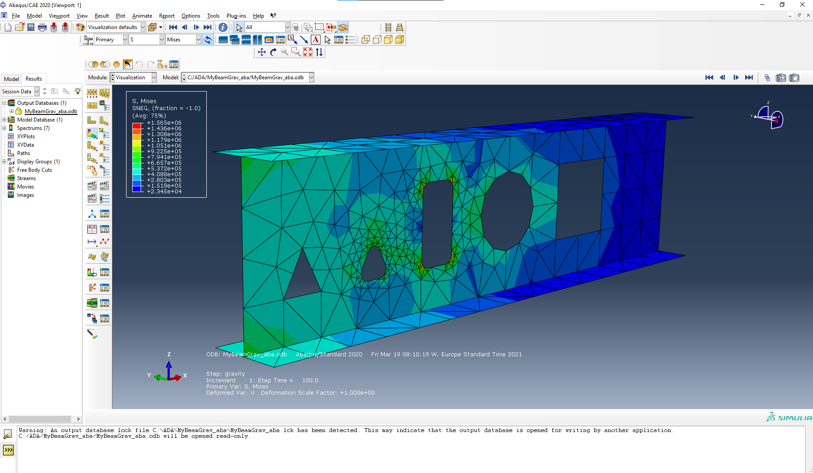

# ADA - Assembly for Design & Analysis

A python library for working with structural analysis and design delivering an object-oriented framework for modelling 
and Finite Element (FE) model conversion, editing, analysis and postprocessing. 

With `ada` you can (among other things) convert your FE models to IFC, create your own recipes for creating FE mesh from
your IFC models, or build your design from the ground up using fully customizable and extendible python classes and 
functions to build parametric designs with rules for automated joint/penetration identification and steel detailing. 

Additionally, you can create unittests to not only test the code that makes your structure, but also create tests 
that checks the capacity of your structure by running FE analysis on it and validating the resulting 
stresses and strains generated by your FE software of choice. 

And since everything is open source and written in regular python you are free to easily 
customize and create whatever design and analysis pipeline of your choosing. 

The FEM formats that has received the most development are Abaqus and Code Aster (the latter being under development 
now), but there is also basic support for Calculix, Sesam and Usfos. There is also support for conversion of FEM meshes 
to/from meshio (which supports many more FEM formats, but does not support FEM information such as beam/shell thickness, 
materials etc..)

Part of the goal is to build the necessary tools for anyone to add support for their favorite FEM format with as 
few lines of code as possible.

This library is still undergoing significant development so expect there to be occasional bugs and breaking changes.

## Quick Links

Clicking the link below will open a jupyter notebook client in the cloud using the latest version of adapy with 
Code Aster and Calculix pre-installed.

[](https://mybinder.org/v2/gh/Krande/adapy/main)


* Feel free to start/join any informal topic related to adapy [here](https://github.com/Krande/adapy/discussions).
* Issues related to adapy can be raised [here](https://github.com/Krande/adapy/issues)


## Installation
Here are the steps necessary to install the ada package

Note that it is recommended to create an isolated environment for the installation. You can create a new environment
like so:

```
conda create -n adaenv 
activate adaenv
```

### Using Pypi
To install ada using pip

First you need to have installed `ifcopenshell` and `pythonocc-core` from conda-forge. 

`conda -c conda-forge ifcopenshell pythonocc-core==7.5.1 occt==7.5.1`

After the conda-forge dependencies are installed you can install ada using 

`pip install ada-py`

(which will automatically include all dependencies from PyPi)


### Using Conda (Note! Work in progress)
Note! Conda installation is not yet set up.

[comment]: <> (To install using conda you can use)

[comment]: <> (`conda install -c krande -conda-forge ada`)


## Usage
Some examples of using the ada package 


### Create an IFC file

The following code

```python
from ada import Assembly, Part, Beam

a = Assembly("MyAssembly") / (Part("MyPart") / Beam("MyBeam", (0, 0, 0), (1, 0, 0), "IPE300"))
a.to_ifc("C:/temp/myifc.ifc")
```

creates an Ifc file containing an IfcBeam with the following hierarchy 
    
    MyAssembly (IfSite)
        MyPart (IfcBuildingStorey)
            MyBeam (IfcBeam)


The resulting IfcBeam (and corresponding hierarchy) shown in the figure above is taken from the awesome 
[blender](https://blender.org) plugin [blenderbim](https://blenderbim.org/).

### Convert between FEM formats

Here is an example showing the code for converting a sesam FEM file to abaqus and code aster

_Note! Reading FEM load and step information is not supported, but might be added in the future._

```python
from ada import Assembly

my_fem_file = 'path_to_your_sesam_file.FEM'

a = Assembly()
a.read_fem(my_fem_file)
a.to_fem('nam_of_my_analysis_file_deck_directory', 'abaqus')
a.to_fem('nam_of_my_analysis_file_deck_directory_code_aster', 'code_aster')

# Note! If you are in a Jupyter Notebook\lab environment 
# this will generate a pythreejs 3D visualization of your FEM mesh
a
```

Current read support is: abaqus, code aster and sesam
Current write support is: abaqus, code aster and sesam, calculix and usfos

### Create and execute a FEM analysis in Calculix, Code Aster and Abaqus

This example uses a function `beam_ex1` from [here](src/ada/param_models/fem_models.py) that returns an
Assembly object with a single `Beam` with a few holes in it (to demonstrate a small portion of the steel detailing 
capabilities in ada and IFC) converted to a shell element mesh using a FE mesh recipe `create_beam_mesh` found 
[here](ada/fem/io/mesh/recipes.py). 

```python
from ada.param_models.fem_models import beam_ex1

a = beam_ex1()

a.to_fem("MyCantilever_abaqus", "abaqus", overwrite=True, execute=True, run_ext=True)
a.to_fem("MyCantilever_calculix", "calculix", overwrite=True, execute=True)
a.to_fem("MyCantilever_code_aster", "code_aster", overwrite=True, execute=True)
```

after the code is executed you can look at the results using supported post-processing software or directly
in python using Jupyter notebook/lab (currently only supported for Code Aster) for the FEA results.






To access the stress and displacement data directly using python here is a way you can use meshio to read the results 
from Calculix and Code Aster (continuing on the previous example).

```python
from ada.config import Settings
import meshio

vtu = Settings.scratch_dir / "MyCantilever_calculix" / "MyCantilever_calculix.vtu"
mesh = meshio.read(vtu)

# Displacements in [X, Y, Z] at point @ index=-1
print('Calculix:',mesh.point_data['U'][-1])

rmed = Settings.scratch_dir / "MyCantilever_code_aster" / "MyCantilever_code_aster.rmed"
ca_mesh = meshio.read(rmed, 'med')

# Displacements in [X, Y, Z] at point @ index=-1
print('Code Aster:',ca_mesh.point_data['DISP[10] - 1'][-1][:3])
```

**Note!**

The above example assumes you have installed Abaqus, Calculix and Code Aster locally on your computer.

To set correct paths to your installations of FE software you wish to use there are a few ways of doing so.

1. Add directory path of FE executable/batch to your system path.
2. Add directory paths to system environment variables. This can be done by using the control panel or 
   running the following from a cmd prompt with administrator rights:
    
```cmd
:: Windows
setx ADA_abaqus_exe <directory of your abaqus.bat>
setx ADA_ccx_exe <directory of your ccx.exe>
setx ADA_code_aster_exe <directory of your as_run.bat>

:: Linux?

:: Mac?
```
3. Set parameters in python by using environment variables or the ada.config.Settings class, like so:

```python
import os
os.environ["ADA_ccx_exe"] = "<directory of your ccx.exe>"
os.environ["ADA_abaqus_exe"] = "<directory of your abaqus.bat>"
os.environ["ADA_code_aster_exe"] = "<directory of your as_run.bat>"
```

or

```python
from ada.config import Settings
Settings.fem_exe_paths["ccx"] = "<directory of your ccx.exe>"
Settings.fem_exe_paths["abaqus"] = "<directory of your abaqus.bat>"
Settings.fem_exe_paths["code_aster"] = "<directory of your as_run.bat>"
```

For installation files of open source FEM software such as Calculix and Code Aster, here are some links:

* https://github.com/calculix/cae/releases (calculix CAE for windows/linux)
* https://code-aster-windows.com/download/ (Code Aster for Windows Salome Meca v9.3.0)
* https://www.code-aster.org/spip.php?rubrique21 (Code Aster for Linux)
* https://salome-platform.org/downloads/current-version (Salome v9.6.0 for windows/linux)

## For developers

For developers interested in contributing to this project feel free to 
make a fork, experiment and create a pull request when you have something you would like to add/change/remove. 

Before making a pull request you need to lint with, isort, flake8 and black. 

````
pip install black isort flake8
isort .
flake8 .
black .
````


## Project Responsible ###

	Kristoffer H. Andersen